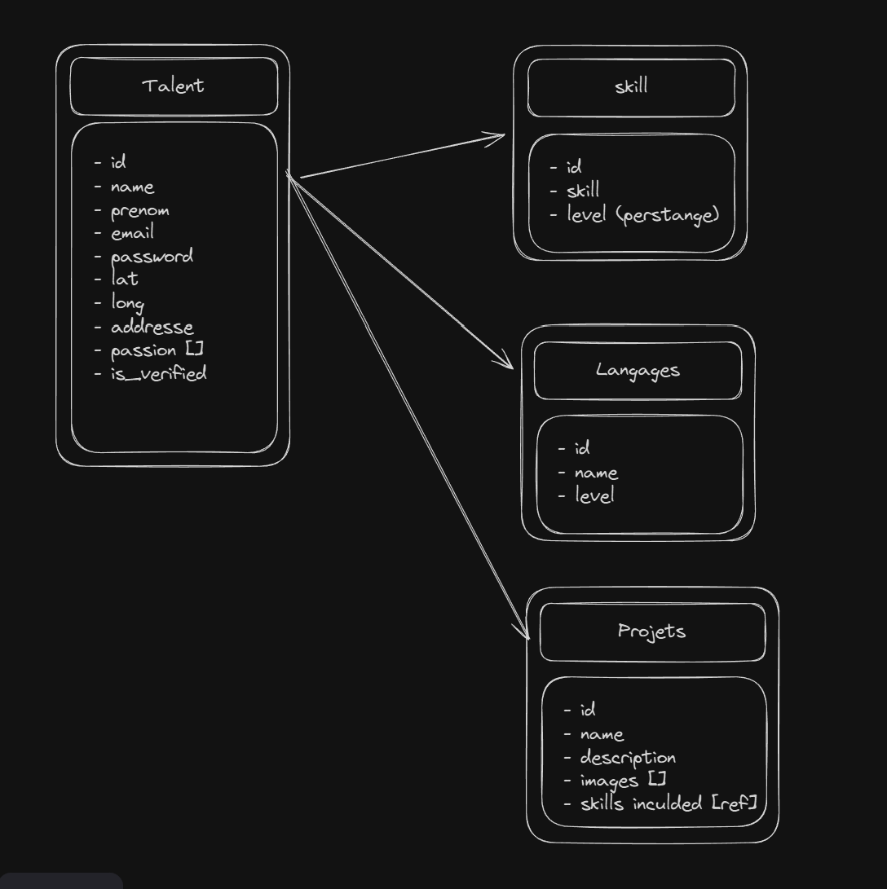

[Live URL](https://cesi-chi.vercel.app/)

# Description de projet 
Le projet consiste a développer une application web de gestion de talents, qui permettant a des talents de s'inscrire, d'avoir plus de visibilité, et pour les recruteurs ou collaborateurs de leur contanter plus facilement.

### Fonctionnalités Principales
- Inscription des talents avec des informations personnelles
- Affichage des profils de talents sur une carte interactive
- Recherche et filtrage des talents par compétences et localisation
- Ajout de compétences aux profils des talents
- Management des profiles des talents

### Fonctionalités Implémentées
- Formulaire d'inscription des talents
- Affichage des profils de talents sur une carte interactive
- Remlissage des information de base du profil des talents
- Consultation des profils des talents a partir de la carte

### Technologies Utilisées
- Next.js pour le développement de l'application web
- TypeScript pour la sécurité de type
- Tailwind CSS pour le style et la mise en page
- Supabase pour la gestion de la base de données et l'authentification

### Schéma de la Base de Données
<p align="center" style="padding: 20px;">
  
</p>

## Getting Started
First, run the development server:

```bash
npm run dev
# or
yarn dev
# or
pnpm dev
# or
bun dev
```

Open [http://localhost:3000](http://localhost:3000) with your browser to see the result.

Il faut configurer les variables d'environnement pour connecter l'application a Supabase. Créez un fichier `.env.local` a la racine du projet et ajoutez les variables suivantes:

```
NEXT_PUBLIC_SUPABASE_URL=your_supabase_url
NEXT_PUBLIC_SUPABASE_ANON_KEY=your_supabase_anon_key
```